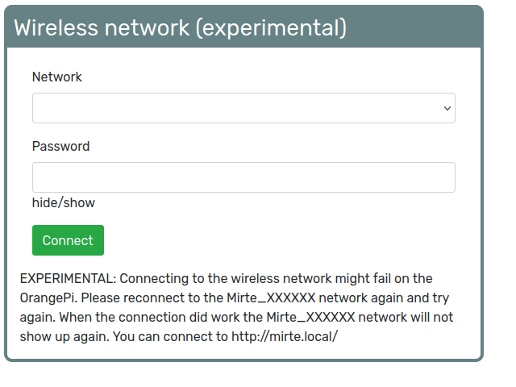

Connect to Mirte
################

Currently there are four ways to connect to your Mirte robot. The availability depends on the SBC 
(OrangePi Zero LTS or Raspberry Pi 2/3/4) you use. This section describes all four options. 

.. note::
   
   When connecting though wireless, or USB (so the first two options), you will be connected to
   the robot through ethernet. You will therefore not have access to internet on your machine. 

Wireless (Wifi)
===============

After booting up Mirte for the first time the robot is in access point (AP) mode and a wifi network 
will be available with ssid Mirte-XXXXXX. You can connect to this network with the password 
'mirte_mirte'. While in AP mode, the ip address of Mirte is 192.168.42.1, but you could also access 
it with mirte.local or mirte-XXXXXX.local:

.. code-block:: bash
   
   $ ping mirte.local

.. code-block:: bash
   
   $ ping mirte-XXXXXX.local

.. code-block:: bash
   
   $ ping 192.168.42.1

In a classroom setting there might me multiple Mirte APs available. It is advised to prepare the
robots in advance and write down the ssid per robot. If this is not possible one could also
get the unique XXXXXX value by analyzing the red and green LED on the Orange Pi Zero (this is not 
yet supported for the Raspberry Pi). 

Count the number of blinks of the red LED until the green one blinks. This is one of the X's in
the ssid. Please note that this is hexadecimal, so 10 will be A, 11 will be B etc). Do this until 
you have all 6 X's. Please note that the start of the sequence (and thus the start of the first X) 
is shown by blinking both red and green. The full XXXXXX will be communicated in this way for 5 
times.

.. note::

   The OrangePi has a known issue with the WiFi driver, makeing it unstable from time to time. This
   also affects the speed of your WiFi connection in acces point (AP) mode. Your connection will be about
   10x faster when :ref:`connected to your own router<Connecting Mirte to your own Wifi>`.

USB connection (Windows only)
=============================

When connecting to Wifi is not possible you can also connect through USB. In this case you need
to connect the power of the Orange Pi Zero via USB with your computer. After booting up a wired
network will be available with which you can connect. While in USB mode, the ip address of Mirte
is 192.168.43.1, but you could also access it with mirte.local or mirte-XXXXXX.local:

.. code-block:: bash
   
   $ ping mirte.local

.. code-block:: bash
   
   $ ping mirte-XXXXXX.local

.. code-block:: bash
   
   $ ping 192.168.43.1

Ethernet Wired
==============

You can also connect a wired ethernet cable using Mirte. Make sure you connect an ethernet cable
to a router with DHCP enabled so your robot will get an ip address from the router:

.. code-block:: bash
   
   $ ping <ip-address from router>

There are multiple ways to get the ip address from the router. On Linux and MacOS the easiest
way is to ping for mirte.local:

.. code-block:: bash
   
   $ ping mirte.local

.. note::

   mDNS is not supported by Windows and therefore you can not use mirte.local in this setup.

   When possible you could also log into your router and see what ip address the router assigned.
   If this also is not an option you could also decode the ip address from the blinking scheme 
   (as described above in the Wireless section). This currently is only supported for the Orange Pi
   Zero.

.. note::
  
   You can also connect the wired cable when already connected to Wireless. This will enable
   internet (through your router) to the robot, but not to your own computer.

Connecting Mirte to your own Wifi
=================================

You can connect Mirte to your local wifi network from either of the two interfaces (web or
terminal). You therefore first need to connect to Mirte via one of the methods mentioned
above. Make sure to connect to either of them following the instructions from the
:ref:`next section<Accessing the interface>`.

From terminal
-------------

When connecting though the terminal execute the following command. This will sleep for 10
seconds and then try to connect to your wifi. the 10 seconds sleep is done to make sure 
the AP connection will be disconnected properly.

.. code-block:: bash
   
   mirte$ nohup `$(sleep 10; sudo nmcli d wifi connect <wifi_SSID> password <wifi_password>)` & sudo nmcli d disconnect wlan0

.. warning::
   Make sure that you type the SSID and password correctly. When this fails the wifi AP
   will not show up automatically and you have to reboot Mirte.

.. note::
   This will freeze your terminal since the ssh connection was disconnected since the
   wifi changed. You can get your terminal back typing '~.' (tilde point).

From web interface
------------------

In the web interface there is also an option to connect to your local wifi. In your favorite
browser visit http://mirte.local/#/Settings and select the network and password.

.. warning::
   
   This is still experimental. Connecting on the Orange Pi Zero might fail and will bring up
   the AP again. This might take some tries to get the connection saved.

.. note::

   Even after you connected to your own network, Mirte will start an Access Point in case she 
   is not able to connect to it (e.g. when out of range).

Renaming Mirte
==============

In some cases it might be useful to rename the unique ID of your Mirte (the XXXXXX part). 
This can be done by changing the linux hostname:

.. code-block:: bash

   mirte$ sudo bash -c "echo <new ID> > /etc/hostname"
   mirte$ sudo reboot now

You should now be able to connect to Mirte_<new ID>.
