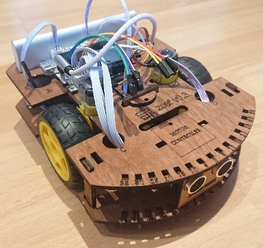

Mirte (Mirte, an Inspiring Robot for Technology Education) is yet another robot developed for
education. Robotics, due to the its multidisciplinary nature, is a good way to teach about STEM
eduction. This is why a lot of robotics kits have been developed already. So why yet another?
We believe that robotic kits for education should be cheap, open source, not only focus on the
software, have as few custom parts as possible, and should be useful from primary/elementary school
all the way to university. Getting you to the next level in each discipline step by step.

+-------------+--------------------------------------------------------------------------------------------------------------------------------+
| Software    | from `Blockly <https://developers.google.com/blockly>`_ to `Python <https://www.python.org/>`_ to `ROS <https://www.ros.org>`_ |
+-------------+--------------------------------------------------------------------------------------------------------------------------------+
| Electrical  | from custom PCB with Raspberry Pi Pico (RP2040), to breadboard with STM32/Arduino                                              |
+-------------+--------------------------------------------------------------------------------------------------------------------------------+
| Mechanical  | from wooden frame to own made (3D printed) frames                                                                              |
+-------------+--------------------------------------------------------------------------------------------------------------------------------+
| Interaction | from cute to purely functional                                                                                                 |
+-------------+--------------------------------------------------------------------------------------------------------------------------------+

|pic1| |pic2|

.. |pic2| image:: _images/mirte_web_interface.png
   :width: 60%
