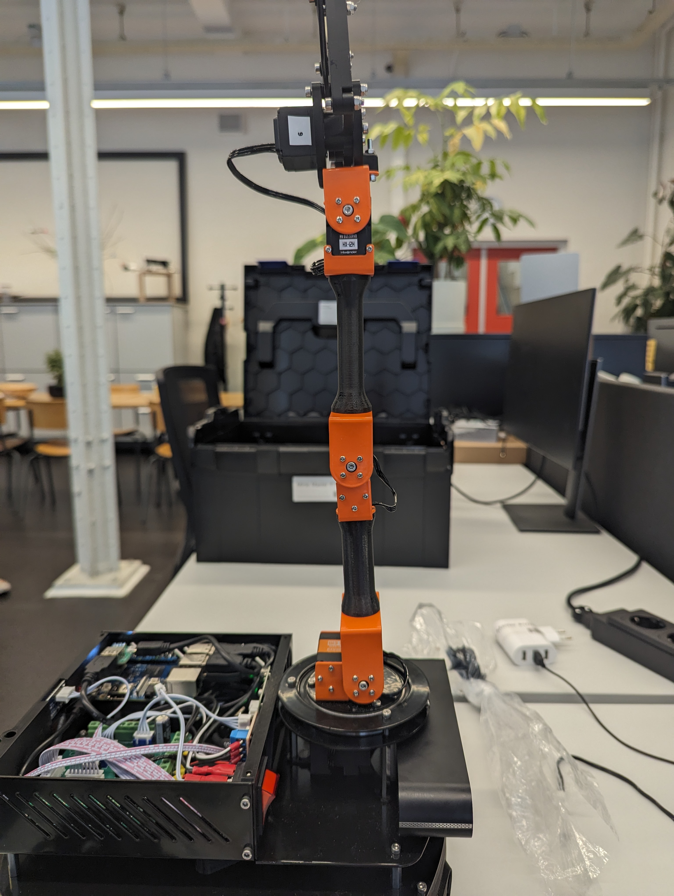
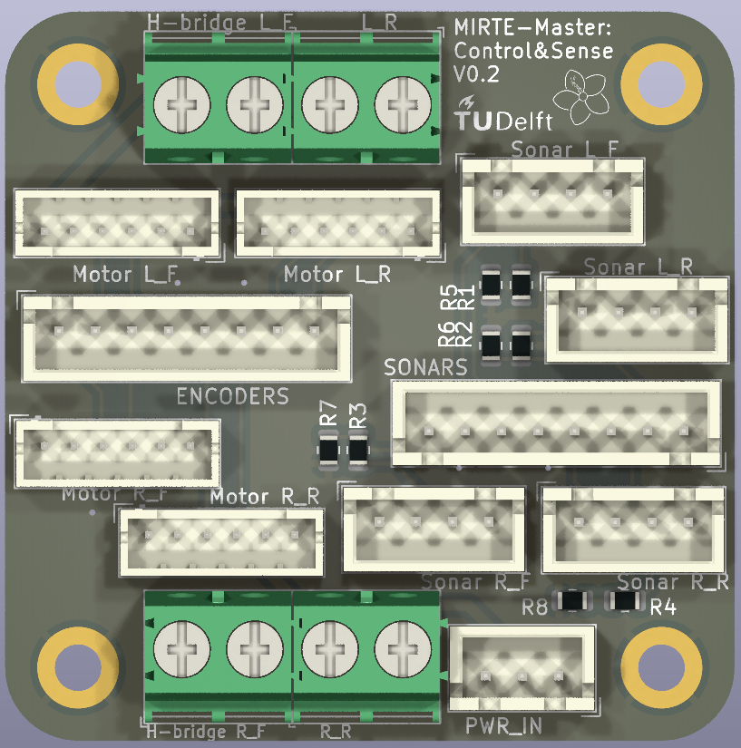

# Mirte Master


The Mirte Master is one of the possible upgrades of the Mirte robot.

<!-- .. plaatje -->

## Frame


The frame is built using 1mm aluminium and 3D printed parts. 
Building instructions:
- [Base](../_static/Assembly_BASE.pdf)
- [Top and arm](../_static/Assembly_TOP_ARM.pdf)


### Base

Change PID parameters of the base controller with:
```rosrun dynamic_reconfigure dynparam set /mobile_base_controller p 1```


### Arm

The arm has 4 servos for movement and one for the gripper. The ranges are stored in the servo together with a deviation to keep the config the same, while the servos can be mounted differently. The user should never have to deal with the centidegrees ranges, only the range and angles in radians. The "Bus Servo Serminal" ranges are only when you have a new arm without ranges set. You can set the ranges and IDs with [Bus Servo Terminal](https://drive.google.com/drive/folders/1wIIIccKKmrLX4EyswIkunIs-A_SKX1Nq) and a [Buslinker](https://www.hiwonder.com/collections/servo-controller/products/hiwonder-ttl-usb-debugging-board).

| Servo    | ID  | Range(centidegrees) | Range (Bus servo terminal) | Range (rad) | Home  |
| -------- | --- | ------------ | ----------- | ----- | --- |
| Rotation (black, HX-12H) | 2   | 3400-21000*  | 141-875 | [-1.6, 1.5] | 12000 |
| Shoulder (orange, HTD-45H) | 3   | 2832-20000* | 118-833 |  [-1.5, 1.5]   | 11450 |
| Elbow (green, HTD-35H)   | 4   | 120-21000   | 5-875 |  [-2,	1.6] | 11750 |
| Wrist (black, HX-12H)  | 5   | 1128-21672*  | 47-903 |  [-1.7,	1.9]  | 12200 |
| Gripper (black, HX-12H) | 6   | 6168-11224 **         | 257-468  | [-0.7,	0.2]          | 9984     |
-------
`*`: inverted rotation, range has taken care of this

`**`: Longer range than the gripper can reach

The services for the servos use the radian ranges. Getting the ranges is possible by calling the `/mirte/get_<name>_servo_range`.

The home position of the arm is forward pointing up:
- Arm is rotated forward:
-  
- Arm is pointing up:
-  
- The Gripper has the servo-driven beams horizontal:
-  


#### Moveit

TODO!

<!-- .. TODO: @mklomp -->


## Software
The Mirte-master is using the same base software as any other Mirte robot, with some extras.

### Computer

The computer is a Orange Pi 3B with 4gb RAM and 16/32 eMMC. It is running a Armbian 23.11 Focal image with ROS Noetic. You can download a fresh image from `here <https://github.com/ArendJan/mirte-sd-image-tools/actions/workflows/buildFork.yaml>`_. Click on the latest action from the `mirte-master` branch and then download the ```mirte_master_mirte_orangepi3b``` or ```mirte_master_installer_orangepi3b``` artifact. The ```..._installer_...``` can be used to flash the eMMC. At boot it will copy the image (same as the normal one) to the eMMC, setup bootloader to be sure and shut down. This can take around 20 minutes. 
<!-- All the download are on [mirte.arend-jan.com](https://mirte.arend-jan.com/files/mirte-master/) as well. -->
It works the same as the normal Mirte robot. Move the base with publishing to ```/mobile_base_controller/cmd_vel``` with a geometry_msgs/Twist message. 

ROS2 support is WIP. 

### Master Mirte-install-scripts
[mirte-install-scripts:mirte-master2](https://github.com/ArendJan/mirte-install-scripts/tree/mirte-master2)

Changes from default:
- Password system:
  - After changing the pw (first login):
    - the user password changes
    - the website login changes
    - after the next boot: the Wi-Fi password is changed, only if the password is long enough ( 8 characters )
- Website:
  - different urls:
    - video server: http://mirte.local/ros-video/
    - jupyter (if enabled?): http://mirte.local/jupyter/
    - docs: http://mirte.local/docs/
    - visual studio code (browser): http://mirte.local/code/
  - Login:
    - When accessing any of the sites from any IP other 192.168.40.1-47.255 (Wi-Fi hotspot) or 192.168.137.1-255 (Windows hotspot), you'll need to log in. This is the same user and password as when logging in with SSH
    - To allow more IP ranges, edit ```/etc/nginx/nginx_login.conf``` 
- extra ROS packages:
  - https://github.com/Slamtec/rplidar_ros.git: lidar node
  - https://github.com/orbbec/ros_astra_camera.git: depth camera node
  - https://github.com/arendjan/ridgeback.git: mecanum wheel support with custom fix.
- Picotool installed to easily flash the Raspberry Pi Pico
- more ZSH support
- Support for @chris-pek his chat-gpt ROS node
- USB-switch systemctl module:
  - after boot, this module will turn on a GPIO pin (GPIO4_C3) to turn on the USB switch IC on the small board on top of the Orange Pi. This is to fix a power bug of the Orbbec Astra camera (pulling 1A+ when plugged in at boot)

### Mirte-ros-packages
[mirte-ros-packages:mirte-master](https://github.com/ArendJan/mirte-ros-packages/tree/mirte-master)

Changes:
- Added extra launch files (mirte_bringup)
- added omniwheels (ridgeback) support (mirte_control)
  - TODO: feedback motor <-> encoders
- Telemetrix:
  - Extra config for mirte-master
    - TODO: IMU
  - Oled: shows SOC, IP, hostname and Wi-Fi host
  - Hiwonder UART servos:
    - Added servo support, services/topics:
      - ```/mirte/set_{servo_name}_servo_angle``` SetServoAngle service, in radians from home
      - ```/mirte/set_{servo_name}_servo_enable``` SetBool service, enable or disable servo. After sending a new angle, it is enabled again
      - ```/mirte/servos/{servo_name}/position``` ServoPosition topic, radians from home
      - ```/mirte/set_{bus_name}_all_servos_enable``` SetBool service, enable or disable all servos on this bus.
  - Neopixel support (WS2811)
    - ```/mirte/set_{name}_color_all``` SetLedValue service, uint32_t color, with ```0xRRGGBB``` or ```0xRRBBGG``` value (0-255)
    - ```/mirte/set_{name}_color_single``` SetSingleLedValue service, same color setup with a 0-indexed pixel id
  - PCA9685 (pwm driver):
    - For servos:
      - When any servo is added, frequency will be set to 50Hz. 
      - ```/mirte/set_{name}_servo_angle``` SetServoAngle service, with angle [0, 180]
    - Motors (2x PWM channel):
      - Normal motor service and topics
      - Range is [-100, 100]
  - INA226 (power watcher)
    - used to measure current and voltage. Can trigger a shutdown if the LiPo voltage is too low. The current state of charge(SOC) can be shown with a LED and the OLED screen.
      <!-- Also detects the power switch to safely shut down the robot. Not working bc hardware issues with relay -->


### Telemetrix4RpiPico:
[Repo](https://github.com/ArendJan/Telemetrix4RpiPico/tree/modules2)
- Added support for multiple devices:
  - Hiwonder servos
  - PCA9685
  - INA226
  - MPU9250 IMU
  
  Not yet added to ROS:
  - HX711 load cell
  - VL93L0 distance sensor
  - ADXL345 accelerometer
  - VEML6040 color sensor

### Flashing the Pico
<s> Go to /usr/local/src/mirte/mirte-install-scripts/ and run ./upload_arduino.sh upload_pico Telemetrix4rpipico. This will stop ROS, flash the Pico and restart ROS again. If flashing failed or something else, it will tell you how to restart ROS again. </s>

Download the latest uf2 from [here](https://github.com/mirte-robot/Telemetrix4RpiPico/pull/14) (build and deploy -> summary -> artifacts) and upload it with picotool ( `sudo picotool load -f Telemetrix4RpiPico.uf2` ).

## Electronics
The Mirte-master is built to be as easy to work with as possible, there should be no need to change anything in the electronics.

The Mirte-master has 4 PCBs:
- Mirte compute (main pcb), with a Pico
- Mirte Sense and Control, connecting the motor drivers, encoders, main PCB and the sonars together
- BMS board, converting the JST-XH connector of the LiPo battery to the JST-PH connector of the 3s BMS
- USB switch board, switching the power of the Orbbec Astra depth camera

Assembly instructions:

[Instructions](../_static/Assembly_electro.pdf)

### Mirte compute
[mirte-pcb:mirte-master/mirte-master](https://github.com/ArendJan/mirte-pcb/tree/mirte-master/mirte-master)

Errata (v0.2):
- 5v and GND labels(bottom) for the 12v->5v screw terminal are inverted
- power switch cable to pcb must be removed to disable the light in the switch.
- relay system doesn't work.


### Mirte sense&Control
[mirte-pcb:mirte-master/mirte-master-bottom](https://github.com/ArendJan/mirte-pcb/tree/mirte-master/mirte-master-bottom)


### Usb switcher
[mirte-pcb:mirte-master/mirte-usb-switcher](https://github.com/ArendJan/mirte-pcb/tree/mirte-master/mirte-usb-switcher)

Leds:
- D2: GPIO4_B4, used for blinking SOC
- D1: GPIO4_B5, unused
- D4: GPIO0_D1, unused
- D3: GPIO4_C3, used for USB power switch

J4, unsoldered header for any use:
- 3v3
- D2: GPIO4_B4
- D1: GPIO4_B5
- D3: GPIO0_D1
- D4: GPIO4_C3
- GND

Image shows 2x4 header on top, must be soldered on the bottom.

Errata:
- GPIO4_D4 label(bottom side) should be GPIO4_C3 due to faulty Orange Pi pinout diagrams. 

### BMS board
[mirte-pcb:mirte-master/mirte-bms-breakout](https://github.com/ArendJan/mirte-pcb/tree/mirte-master/mirte-bms-breakout)


## WIP:
- servos fix forgetting ID
- IMU 

.. mdinclude:: mirte_master_servos.md

## Building your own!
### Parts
This is the list of parts we used for the MIRTE-master. Links show the parts we used, but often it can be a similar one.

| Amount | Name | Type | Note |
| --- | --- | --- | --- |
| 1 | Depth camera | [RGB-D	orbbec astra pro plus](https://store.orbbec.com/products/astra-pro-plus) | Remove the base |
| 1 | Lidar | [Slamtech rplidar c1](https://www.slamtec.com/en/C1) [Seedstudio buy](https://www.seeedstudio.com/RPLiDAR-C1M1-R2-Portable-ToF-Laser-Scanner-Kit-12M-Range-p-5840.html) | |
| 1 | Computer | Orange Pi 3B (4GB + 32GB)	| [4GB ram, 32GB emmc](https://nl.aliexpress.com/item/1005005948880241.html) (option 2 & 4GB), only version 1.1 tested |
| 1 | Microcontroller | [Raspberry Pi Pico H](https://www.raspberrypi.com/products/raspberry-pi-pico/) |  |
| 1 | Main control PCB (top) | [kicad project](https://github.com/ArendJan/mirte-pcb/tree/main/mirte-master) |
| 1 | Small control PCB (bottom) | [kicad project](https://github.com/ArendJan/mirte-pcb/tree/main/mirte-master-bottom) |
| 1 | Tiny PCB for switching power to depth camera | [kicad project](https://github.com/ArendJan/mirte-pcb/tree/main/mirte-usb-switcher) |
| 2 | JST XH cables 4 pins 10cm | for INA226 & OLED, [link](https://nl.aliexpress.com/item/1005002179605258.html) |
| 6 | JST XH cables 4 pins 30cm | for sonars to bottom PCB. 20cm fits tightly <br/> PCA9685 to H-bridges [link](https://nl.aliexpress.com/item/1005002179605258.html) |
| ? | JST XH cable 3 pins 30cm | power to bottom PCB [link](https://nl.aliexpress.com/item/1005002179605258.html) |
| ? | JST XH cable 8 pins 30cm | sonar and encoder cables to bottom PCB [link](https://nl.aliexpress.com/item/1005002179605258.html) |
| ? | JST XH cable 6 pins 30cm | PCA9685 cable [link](https://nl.aliexpress.com/item/1005002179605258.html) |
| 4 | JST **PH** cable 6 pins 20cm | bottom PCB to motors [link](https://nl.aliexpress.com/item/1005006188790994.html) |
| 2 | micro USB cable 15 cm | Pico data cable and depth camera (Orange Pi to switch PCB) |
| 1 | Orange Pi power cable | USB-C cable	| |
| 1 | 12-5V step down		|[link](https://nl.aliexpress.com/item/1005006721587257.html) |
| 1 |16 PWM servo module		| PCA9685 servo module [link](https://nl.aliexpress.com/item/1005007039294615.html) |
| 1 |Power sensor | INA226, software is hardcoded for the 20A version with a R010 shunt resistor		| [link](https://nl.aliexpress.com/item/1005007162223972.html)|
| 1 |OLED	|SSD1306 128x64 0.96 inch|[link](https://nl.aliexpress.com/item/1005007755490093.html) |
| 1 |Switch|SPDT rocker switch|[link](https://nl.aliexpress.com/item/1005004694368770.html) |
| 4 |DC Motors |	12V 200 RPM default. 107 for lower speed, but better stall-speed and precision.	| [link](https://nl.aliexpress.com/item/1005005021902364.html) |
| 1 |Battery | 5000 mAh, 3S, min 5C | [link](https://hobbyking.com/en_us/turnigy-5000mah-3s-20c-lipo-pack-xt-90.html) |
| 1 |USB-C lipo charger |[link](https://nl.aliexpress.com/item/1005005356623076.html) <br/> For 3S battery, use 2A type, 4A is not supported by most chargers. |
| 2 |H-Bridge |	L298N	| [link](https://nl.aliexpress.com/item/1005006794464360.html) |
| 1 |Mecanum wheels (set of 4)	| 100mm, set of 2 left, 2 right [link](https://nl.aliexpress.com/item/1005007533099560.html) | Need to drill the adapter hole to 6mm for the motor shafts | 
| 1 |Sonar | HC-SR04|[link](https://nl.aliexpress.com/item/32283526790.html) |
| 1 |IMU | (current version ) MPU9250, future ? | [link](https://nl.aliexpress.com/item/1005007196461566.html) |
| optional |LED strip | ws2812, other versions WIP ||
| ??? | square nuts | M3 | |
| 1 | Frame | TODO ||
| 1 |Ball bearing| 6812 2RS|[link](https://nl.aliexpress.com/item/1005007420073930.html) |
| 3 | Small servo |	HX-12H (12KG.CM) [link](https://www.hiwonder.com/products/hx-12h) | For rotation, wrist and gripper |
| 1 | Big servo |	HTD-45H (45 KG.CM) [link](https://www.hiwonder.com/products/htd-45h) | For shoulder (orange) |
| 1 | Medium servo | HTD-35H [link](https://www.hiwonder.com/products/htd-35h) |For elbow (green)|
| 3 | standoff 40mm M3 | support for arm [link](https://nl.rs-online.com/web/p/standoffs/1768193) |
| 3 | standoff 20mm M3 | support for top plate, space used for lidar [link](https://nl.rs-online.com/web/p/standoffs/1768417) |
| 2 | standoff 25mm M2.5 | Orange Pi Support [link](https://nl.rs-online.com/web/p/standoffs/2052959) |
| 4 | standoff 10mm M3 | top PCB support [link](https://nl.rs-online.com/web/p/standoffs/1768379) |
| 82? | M3 x 6 screws | TODO: check count |
| 3 | M3 x 20 screws | TODO: check count |
| 3 | M3 x 16 screws | TODO: check count |
| 16? | M2.5 screws | For mounting the Orange Pi| 
| 11? | M2.5 nuts | For the Orange Pi standoffs |
| 14? | M3 nuts | Use lock bond to keep them from loosening |
| 4 | faston connectors | 2 used for the fuse, 2 for the switch [link](https://www.conrad.nl/nl/p/vogt-verbindungstechnik-3970-platte-stekker-male-insteekbreedte-6-3-mm-insteekdikte-0-8-mm-180-volledig-geisoleer-736986.html) |
| 1 | XT90 connector | Male, for battery |
| 1 | USB C charger | Charge board requires a dumb charger, like [Ikea charger](https://www.ikea.com/nl/nl/p/smahagel-usb-lader-met-3-poorten-wit-60539177/) and a USB-A to USB-C cable |
| 1 | Fuse and fuse holder | We chose 7.5A, never broke. [fuse holder](https://www.conrad.nl/nl/p/tru-components-tc-9070404-zekeringhouder-geschikt-voor-platte-zekering-standaard-30-a-32-v-dc-1-stuk-s-2267601.html) [fuse](https://www.conrad.nl/nl/p/mta-automotive-mta-340026-standaard-platte-zekering-7-5-a-bruin-1-stuk-s-839701.html) |
| 2 | diodes | DO201 | block reverse current from H-bridge. <br/> Can be any with high enough voltage and current rating [link](https://www.reichelt.com/nl/nl/shop/product/schottkydiode_5_a_40_v_do-201-216766) |
| 36 | wire ferrules | red type (1mm2) |[link](https://www.reichelt.com/nl/nl/shop/product/adereindhulzen_-_strips_1_mm_rood-164822) |

We removed the BMS from our robots as they spontanuously started to smoke. We need to find a better replacement.

Frame drawing: [solidworks zip](https://mirte.arend-jan.com/files/Solidworks%20concept%204%20backup%201%20maart.zip)

### Build instructions
WIP: need to add more instructions, also for the cabling.

Frame build instructions: [Instructions](../_static/Assembly_BASE.pdf)

Frame top and arm instructions: [Instructions](../_static/Assembly_TOP_ARM.pdf)

Electronics instructions: [Instructions](../_static/Assembly_electro.pdf)

Electronics and frame assembly needs to be done in sync, otherwise it's too difficult to attach the cables once everything is mounted.
