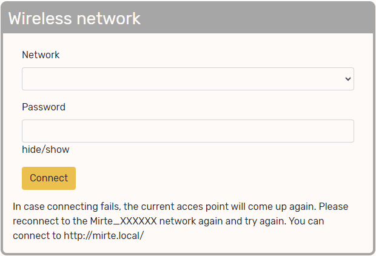

Connect to Mirte
################

When the Mirte robot boots up she will check if she can connect to a known Wifi network (i.e. a 
network which the robot has connected to before). If this fails, she will start her own 
access point (AP) to which you can connect. 

There are multiple ways to connect to your Mirte robot. The availability depends on the SBC 
(Orange Pi Zero 2 or Raspberry Pi 2/3/4) you use. This section describes these options.

.. note::
   
   When connecting though wireless AP, or USB, you will be connected to the robot through ethernet. 
   You will therefore not have access to internet on your machine. 

Wireless Acces Point
====================

After booting up Mirte for the first time the robot is in access point (AP) mode and a wifi network 
will be available with ssid Mirte-XXXXXX (where each X is hex 1-F). You can connect to this network 
with the password 'mirte_mirte'. While in AP mode, the ip address of Mirte is 192.168.42.1, but you 
could also access it with mirte.local or mirte-XXXXXX.local:

.. code-block:: bash
   
   $ ping mirte.local

.. code-block:: bash
   
   $ ping mirte-XXXXXX.local

.. code-block:: bash
   
   $ ping 192.168.42.1

In a classroom setting there might me multiple Mirte APs available. It is advised to prepare the
robots in advance and write down the ssid per robot. If this is not possible one could also
get the unique XXXXXX value by analyzing the red and green LED on the Orange Pi Zero 2 (this is not 
yet supported for the Raspberry Pi). 

Count the number of blinks of the red LED until the green one blinks. This is one of the X's in
the ssid. Please note that this is hexadecimal, so 10 will be A, 11 will be B etc). Do this until 
you have all 6 X's. Please note that the start of the sequence (and thus the start of the first X) 
is shown by blinking both red and green. The full XXXXXX will be communicated in this way for 5 
times.

Wireless Client Mode
====================

The downside of having Mirte in AP mode, is that both your computer and the Mirte robot do not
have access to the internet. By connecting the Mirte robot to another access point (e.g. router)
you can still use the internet while controlling your robot.

If you are not in control of your own router, you can also create one youself by putting your mobile 
phone in hotspot mode, or put your computer (on Windows) in mobile hotspot mode.

You can connect Mirte to your local wifi network from either of the two interfaces (web or
terminal). You therefore first need to connect to Mirte in AP mode and following the instructions 
from the :ref:`next section<Accessing the interface>`. 

.. note::
   Since the Mirte robot is probably still in AP mode when you try to do this, you will only see 
   the Wifi networks that were visible when the robot booted. It is therefore adviced to first 
   start a hostpot/router/AP and then (re)boot the Mirte robot.

.. warning::
   Currently the Mirte robot is not able to connect to WPA3 networks.

From terminal
-------------

The most stable way to connect the Mirte robot to another network will be to login to the Mirte
robot via ssh, manually setting the network settings. The following command will ask for the 
SSID and password of the AP to connect to and reboot:

.. code-block:: bash

   mirte$ read -p "SSID: " ssid && read -p "Password: " -s password && nmcli connection add con-name Mirte-connection type wifi ifname wlan0 wifi.ssid $ssid wifi-sec.key-mgmt wpa-psk wifi-sec.psk $password && sudo reboot now

You can also try a less stable version, where the robot will not reboot but will try to
connect right away. This command will sleep for 10 seconds and then try to connect to your wifi. 
The 10 seconds sleep is done to make sure the AP connection will be disconnected properly.

.. code-block:: bash

   mirte$ nohup `$(sleep 10; sudo nmcli d wifi connect <wifi_SSID> password <wifi_password>)` & sudo nmcli d disconnect wlan0

.. note::
   This will freeze your terminal since the ssh connection was disconnected since the
   wifi changed. You can get your terminal back typing '~.' (tilde point).

From web interface
------------------

In the web interface there is also an option to connect to your local wifi. In your favorite
browser visit http://mirte.local/#/Settings and select the network and password. This will also
try to connect to the wifi right away and might therefore be less successfull.

.. warning::

   Only access points that were online when Mirte booted will be listed.

Other (wired) options
=====================

USB connection
--------------

When connecting to Wifi is not possible you can also connect through USB. In this case you need
to connect the power of the Orange Pi Zero 2 via USB with your computer. After booting up a wired
network will be available with which you can connect. While in USB mode, the ip address of Mirte
is 192.168.43.1, but you could also access it with mirte.local or mirte-XXXXXX.local:

.. code-block:: bash
   
   $ ping mirte.local

.. code-block:: bash
   
   $ ping mirte-XXXXXX.local

.. code-block:: bash
   
   $ ping 192.168.43.1

Wired Ethernet
--------------

You can also connect a wired ethernet cable using Mirte. Make sure you connect an ethernet cable
to a router with DHCP enabled so your robot will get an ip address from the router:

.. code-block:: bash
   
   $ ping <ip-address from router>

There are multiple ways to get the ip address from the router. On Linux and MacOS the easiest
way is to ping for mirte.local:

.. code-block:: bash
   
   $ ping mirte.local

.. note::

   mDNS is not supported by Windows and therefore you can not use mirte.local in this setup.

   When possible you could also log into your router and see what ip address the router assigned.
   If this also is not an option you could also decode the ip address from the blinking scheme 
   (as described above in the Wireless section). This currently is only supported for the Orange Pi
   Zero 2.

.. note::
  
   You can also connect the wired cable when already connected to Wireless. This will enable
   internet (through your router) to the robot, but not to your own computer.

TTL debug
---------

If all of this fails, you can still debug your Mirte robot through the TTL interface. The easiest
way to do this is by using a TTL-USB device and connect to the Mirte. If you have no clue what
this means, you will probably not use this. If you do understand, you can search the internet
to see how to connect to your SBC.

Renaming Mirte
==============

In some cases it might be useful to rename the unique ID of your Mirte (the XXXXXX part). 
This can be done by changing the linux hostname:

.. code-block:: bash

   mirte$ sudo bash -c "echo Mirte-<new ID> > /etc/hostname"
   mirte$ sudo reboot now

You should now be able to connect to Mirte-<new ID>.
