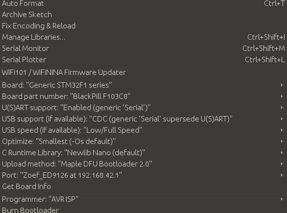

Programming Zoef
################

The goal of Zoef is to get everyone to learn about robotics. This means that there are multiple layers of complexity available.

Blockly
=======

Python in the web interface
================================

Depending on the settings in teh web interface, the Python shown in the web interface will be editable or not. 

Python from commandline
=======================

.. code-block:: python

   import robot
   zoef = robot.createRobot()

The full interface can be found here.

ROS
===

With Blockly being converted into Python, under water the Python code just becomes a running ROS node when started. When robot.createRobot() is called a node named zoef_python_api will be started. So all controll software is done in ROS. You can find the full API of services and topics here.

When Zoef start a systemd service will launch the Zoef bringup. This service can be stopped and started manyally as well:

.. code-block:: bash

   zoef$ sudo service zoef_ros stop
   zoef$ sudo service zoef_ros start

You can also run the launchfile yourself (only when you stopped the systemd service):

.. code-block:: bash

   zoef$ roslaunch zoef_bringup bringup.launch

ROS in Jupyter Notebook
=======================

By default the Jupyter is not running. You can start it as a service:

.. code-block:: bash

   zoef$ sudo service zoef_jupyter start

Jupyter will run on http://zoef.local:8888 showing some examples from Jupyter-ROS (which are located at /home/zoef/jupyter-ros). If you want Jupyter to start on boot you can run:

.. code-block:: bash

   zoef$ sudo systemctrl enable zoef_jupyter

Using the Arduino IDE
=====================
.. warning::
   Since Windows does not fully support mDNS (services) programming from the Arduino IDE will not work on Windows unless you follow the instructions here.
.. warning::
   Currently this is only supported for the SMT32.

Under water ROS assumes an MCU with telemetrix_ installed on it (basically making the MCU a dump machine). Of course you can also program directly on teh MCU. This will break all ROS, Python, Blockly functionality though. In order to program the MCU from the Arduino IDE the PC with the IDE should be connected to the same network as Zoef (or the AP that Zoef created). 

.. _telemetrix: https://github.com/MrYsLab/telemetrix

The Arduino IDE should be configured in the same way as if the MCU was connected to the PC through USB. For the STM this means:

1. Add 'https://github.com/stm32duino/BoardManagerFiles/raw/master/STM32/package_stm_index.json' to 'File' > 'Settings' > 'Additional Boards Manager URLs'
2. Install 'STM32 Cores' from 'Tools' > 'Board: xxxx' > 'Boards Manager...'
3. Select 'Generic STM32F1 series' as 'Board', and make sure the other settings are as in the image below.
4. Compile and run will compile locally and upload the hex to Zoef (passwd: zoef_zoef)

.. note::
   Uploading in this way will stop the ROS master.

You can test this by running the blink example for the STM:

.. code-block:: c

   void setup() {
      pinMode(PC13, OUTPUT);
   }

   void loop() {
     digitalWrite(PC13, HIGH);
     delay(1000);
     digitalWrite(PC13, LOW);
     delay(1000);
   }

.. warning::
   When uploading incorrect images to te STM (for example 'PC_13' instead of 'PC13'), the STM32 might hang, and uploading will not work. In that case you have to press the physical reset button on the STM while the IDE is uploading.

.. note::
   You can always bring up ROS againg by perparing the MCU again (by installing telemetrix on the MCU).

