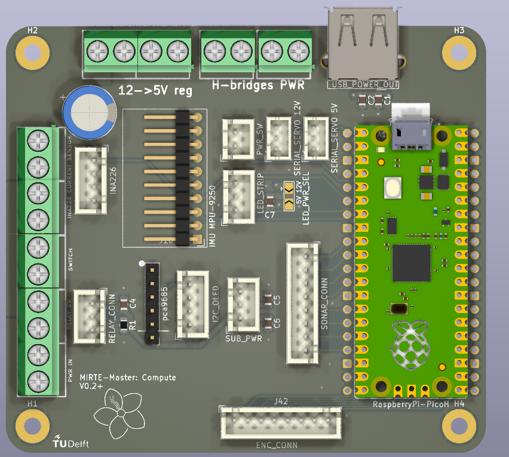
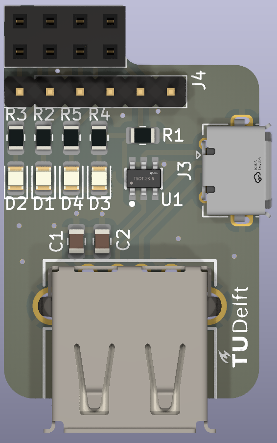
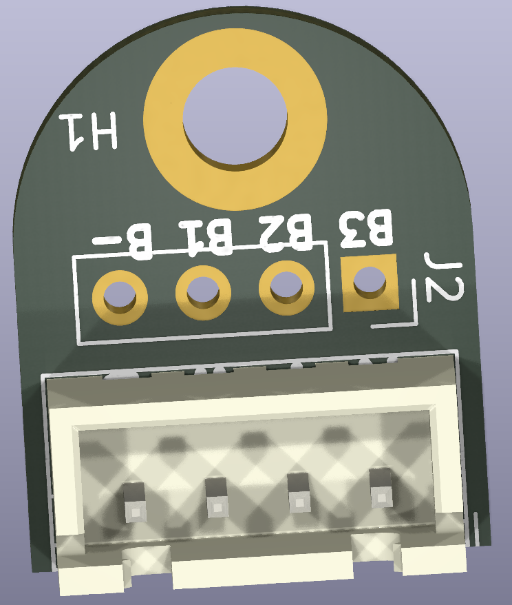

## Frame


The frame is built using 1mm aluminium and 3D printed parts. 
Building instructions:
- [Base](../_static/Assembly_BASE.pdf)
- [Top and arm](../_static/Assembly_TOP_ARM.pdf)


### Base

Change PID parameters of the base controller with:
```rosrun dynamic_reconfigure dynparam set /mobile_base_controller p 1```


### Arm

The arm has 4 servos for movement and one for the gripper. The ranges are stored in the servo together with a deviation to keep the config the same, while the servos can be mounted differently. The user should never have to deal with the centidegrees ranges, only the range and angles in radians. The "Bus Servo Serminal" ranges are only when you have a new arm without ranges set. You can set the ranges and IDs with [Bus Servo Terminal](https://drive.google.com/drive/folders/1wIIIccKKmrLX4EyswIkunIs-A_SKX1Nq) and a [Buslinker](https://www.hiwonder.com/collections/servo-controller/products/hiwonder-ttl-usb-debugging-board).

| Servo    | ID  | Range(centidegrees) | Range (Bus servo terminal) | Range (rad) | Home  |
| -------- | --- | ------------ | ----------- | ----- | --- |
| Rotation (black, HX-12H) | 2   | 3400-21000*  | 141-875 | [-1.6, 1.5] | 12000 |
| Shoulder (orange, HTD-45H) | 3   | 2832-20000* | 118-833 |  [-1.5, 1.5]   | 11450 |
| Elbow (green, HTD-35H)   | 4   | 120-21000   | 5-875 |  [-2,	1.6] | 11750 |
| Wrist (black, HX-12H)  | 5   | 1128-21672*  | 47-903 |  [-1.7,	1.9]  | 12200 |
| Gripper (black, HX-12H) | 6   | 6168-11224 **         | 257-468  | [-0.7,	0.2]          | 9984     |
-------
`*`: inverted rotation, range has taken care of this

`**`: Longer range than the gripper can reach

The services for the servos use the radian ranges. Getting the ranges is possible by calling the `/mirte/get_<name>_servo_range`.

The home position of the arm is forward pointing up:
- Arm is rotated forward:
-  
- Arm is pointing up:
-  
- The Gripper has the servo-driven beams horizontal:
-  


## Electronics
The MIRTE Master is built to be as easy to work with as possible, there should be no need to change anything in the electronics.

The MIRTE Master has 4 PCBs:
- MIRTE compute (main pcb), with a Pico
- MIRTE Sense and Control, connecting the motor drivers, encoders, main PCB and the sonars together
- ~~BMS board, converting the JST-XH connector of the LiPo battery to the JST-PH connector of the 3s BMS~~
- USB switch board, switching the power of the Orbbec Astra depth camera

Assembly instructions:

[Instructions](../_static/Assembly_electro.pdf)

[Rough overview schematic](../_static/mirteMasterSchema.pdf)

### MIRTE compute
[mirte-pcb:mirte-master/mirte-master](https://github.com/ArendJan/mirte-pcb/tree/mirte-master/mirte-master)

Errata (v0.2):
- 5v and GND labels(bottom) for the 12v->5v screw terminal are inverted
- power switch cable to pcb must be removed to disable the light in the switch.
- relay system doesn't work.


### MIRTE sense&Control
[mirte-pcb:mirte-master/mirte-master-bottom](https://github.com/ArendJan/mirte-pcb/tree/mirte-master/mirte-master-bottom)


### Usb switcher
[mirte-pcb:mirte-master/mirte-usb-switcher](https://github.com/ArendJan/mirte-pcb/tree/mirte-master/mirte-usb-switcher)

Leds:
- D2: GPIO4_B4, used for blinking SOC
- D1: GPIO4_B5, unused
- D4: GPIO0_D1, unused
- D3: GPIO4_C3, used for USB power switch

J4, unsoldered header for any use:
- 3v3
- D2: GPIO4_B4
- D1: GPIO4_B5
- D3: GPIO0_D1
- D4: GPIO4_C3
- GND

Image shows 2x4 header on top, must be soldered on the bottom.

Errata:
- GPIO4_D4 label(bottom side) should be GPIO4_C3 due to faulty Orange Pi pinout diagrams. 

### BMS board
[mirte-pcb:mirte-master/mirte-bms-breakout](https://github.com/ArendJan/mirte-pcb/tree/mirte-master/mirte-bms-breakout)




Frame drawing: [solidworks zip](https://mirte.arend-jan.com/files/Solidworks%20concept%204%20backup%201%20maart.zip)

### Build instructions
WIP: need to add more instructions, also for the cabling.

Frame build instructions: [Instructions](../_static/Assembly_BASE.pdf)

Frame top and arm instructions: [Instructions](../_static/Assembly_TOP_ARM.pdf)

Electronics instructions: [Instructions](../_static/Assembly_electro.pdf)

Electronics and frame assembly needs to be done in sync, otherwise it's too difficult to attach the cables once everything is mounted.
