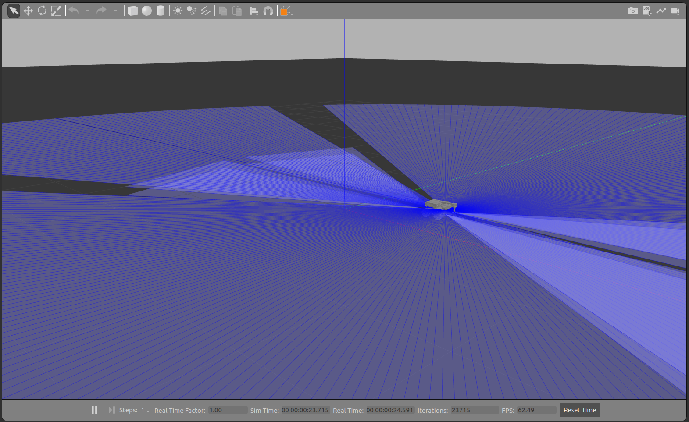

MIRTE Master
############

To start the MIRTE Master in simulation you can:

.. code-block:: bash

   $ ros2 launch mirte_gazebo gazebo_mirte_master_empty.launch.xml

This will start the simulation, including all controllers. In this way
you can control the base, the arm and the gripper.

Controlling the base
--------------------

To control the base, you can send a Twist message to the same cmd_vel
topic as on the physical MIRTE robot (/mirte_base_controller/cmd_vel_unstamped).
The easiest way of doing so, is using the teleop_twist_keyboard package:

.. code-block:: bash

   $ ros2 run teleop_twist_keyboard teleop_twist_keyboard --ros-args --remap cmd_vel:=/mirte_base_controller/cmd_vel_unstamped

Controlling the arm
-------------------

To control the arm, you can send a JointTrajectory message to the topic
(/mirte_master_arm_controller/joint_trajectory). You can move the arm up:

.. code-block:: bash

   $ ros2 topic pub --once /mirte_master_arm_controller/joint_trajectory trajectory_msgs/msg/JointTrajectory "{joint_names: ['shoulder_pan_joint', 'shoulder_lift_joint', 'elbow_joint', 'wrist_joint'], points: [{positions: [0.0, 0.0, -1.56, 1.56], time_from_start:{ sec: 3, nanosec: 0}}]}"

And move the arm down again:

.. code-block:: bash

   $ ros2 topic pub --once /mirte_master_arm_controller/joint_trajectory trajectory_msgs/msg/JointTrajectory "{joint_names: ['shoulder_pan_joint', 'shoulder_lift_joint', 'elbow_joint', 'wrist_joint'], points: [{positions: [0.0, -1.56, -1.56, 1.56], time_from_start:{ sec: 3, nanosec: 0}}]}"

The controller also accepts an action on /mirte_master_arm_controller/follow_joint_trajectory,
but this is mostyl usefull for MoveIt!

Controlling the gripper
-----------------------

To control the gripper, you can send an action to /mirte_master_gripper_controller/gripper_cmd. You cna close the gripper:

.. code-block:: bash

   $ ros2 action send_goal /mirte_master_gripper_controller/gripper_cmd control_msgs/action/GripperCommand "{command: {position: 0.1}}"

And open the gripper:

.. code-block:: bash

   $ ros2 action send_goal /mirte_master_gripper_controller/gripper_cmd control_msgs/action/GripperCommand "{command: {position: -0.1}}"

Planning with MoveIt!
---------------------

With the above command you can move the arm, but there is no planning involved. Nor does
it take collisions into account. This is why it makes sense to use MoveIt! In a 
seperate terminal, you can start Rviz with the MoveIt! 

You can follow the instructions in :ref:`MoveIt!<MoveIt!>`, ans skip the installation
part.

.. note::

   Please note that, in the simulation, you will get errors about the _mimic joints
   not being found. This is a `known issue <https://github.com/ros-controls/gazebo_ros2_control/issues/173>`_ 
   in the Humble gazebo_ros2_control package, but does not affect the working of the
   simulation.
   

