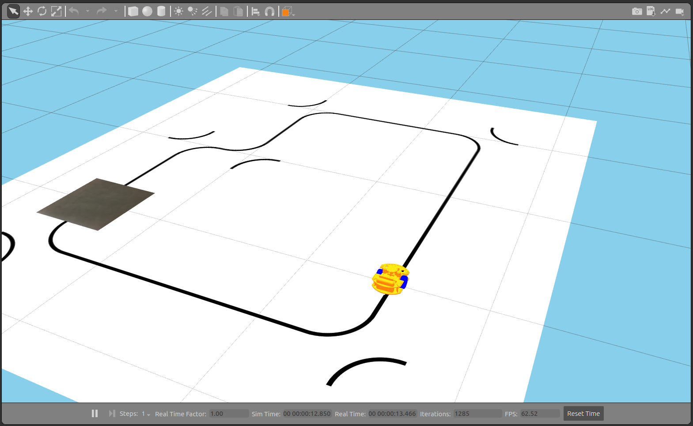

MIRTE Pioneer
#############

To start the MIRTE Pioneer in simulation you can:

.. code-block:: bash

   $ ros2 launch mirte_gazebo gazebo_mirte_pioneer_robocupjunior.launch.xml

This will start the simulation, including the controller for the base.

Controlling the base
--------------------

To control the base, you can send a Twist message to the same cmd_vel
topic as on the physical MIRTE robot (/mirte_base_controller/cmd_vel_unstamped).
The easiest way of doing so, is using the teleop_twist_keyboard package:

.. code-block:: bash

   $ ros2 run teleop_twist_keyboard teleop_twist_keyboard --ros-args --remap cmd_vel:=/mirte_base_controller/cmd_vel_unstamped

.. note::

   In this setup we have added a fixed camera to the environment
   (/camera_top_down/image_raw). It will show the stream of the
   topdown view of the environment. This stream can be used for
   grading purposes and be combined in a CI.
   

