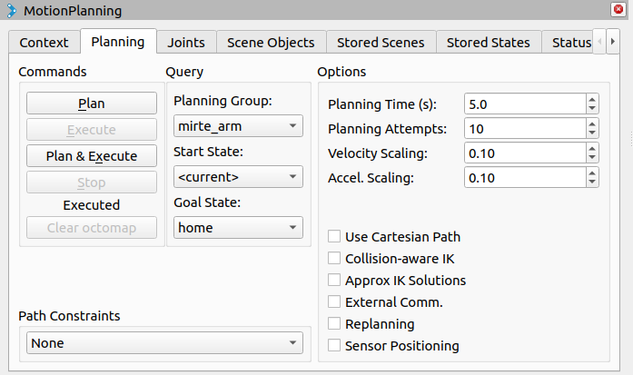

MoveIt!
#########

MoveIt2 is already installed on the MIRTE Master. This tutorial includes
remotely controlling the arm using RViz from a remote computer, and 
basic control of the arm using the MoveIt2 Python API.

RViz 
====

The easiest way to move the arm and gripper is to use RViz. Since this is 
a GUI we need to run this from a remote machine/laptop in the same
network. For this, make sure you have ROS2 humble installed, and that you
have created a ROS2 workspace. We still need to install the MIRTE
MoveIt package:

.. tabs::

   .. group-tab:: From the robot

      The most safe way to do this is installing the package that is
      installed on the actual robot:

      .. code-block:: bash

         $ cd mirte_ws/src
         $ scp -r mirte@mirte.local:/usr/local/src/mirte/mirte-ros-packages .

   .. group-tab:: From github

      You can also install the latets MIRTE MoveIt package from github. This one might
      be out of sync with the software on the robot though:

      .. code-block:: bash

         $ cd mirte_ws/src
         $ git clone https://github.com/mirte-robot/mirte-ros-packages

We can remove all the unwanted packages, and just keep the ones we need:

.. code-block:: bash

   $ cd mirte-ros-packages
   $ shopt -s extglob
   $ rm -rfv !("mirte_moveit_config"|"mirte_description"|"mirte_control"|"mirte_msgs")
   $ rm mirte_msgs/COLCON_IGNORE
   $ cd ../..
   $ rosdep install --from-paths src --ignore-src -r
   $ colcon build

Now that we have installed the MIRTE MoveIt package, we can launch the setup:

.. code-block:: bash

   $ source install/setup.bash
   $ ros2 launch mirte_moveit_config mirte_moveit.launch.py

The MIRTE arm has two planning groups (mirte_arm, and mirte_gripper). You can now select
which planning group you want to use (eg. mirte_arm), and select a goal state. There are
couple of preset states (open/close for the mirte_gripper, and home for the mirte_arm).

By pressing "Plan & Excecute", the robot will execute the planned trajectory. For safety
reasons the default velocity and acceleration scaling is set to 0.10. You can change this
to 1.0 if you want the arm to move faster.

.. note::

   Due to the 4DOF nature of the arm, the blue selector in RViz is not usable.

MoveIt2 C++ API
==================

But of course the most usefull way to use MoveIt, is in your own code. This is why
there are C++ API for MoveIt. The example below will show you how to 
use this API to move the end effector of the robot to a certain position. Note that
this is a MIRTE modified version of the `MoveIt tutorial <https://moveit.picknik.ai/main/doc/tutorials/your_first_project/your_first_project.html>`_.

.. note::

   For later versions of ROS2, there is also a Python API.

The first this we need to do, is create a new C++ package:

.. code-block:: bash

   $ cd ~/mirte_ws/src
   $ ros2 pkg create --build-type ament_cmake --license Apache-2.0 --node-name moveit_example mirte_planning --dependencies rclcpp moveit_ros_planning_interface geometry_msgs

And modify the moveit_example node to:

.. code-block:: c++

   #include <memory>
   #include <thread>
   #include <rclcpp/rclcpp.hpp>
   #include <moveit/move_group_interface/move_group_interface.h>
   #include <geometry_msgs/msg/pose_stamped.hpp>

   int main(int argc, char * argv[])
   {
     // Initialize ROS and create the Node
     rclcpp::init(argc, argv);

     auto const node = std::make_shared<rclcpp::Node>(
       "moveit_node",
       rclcpp::NodeOptions().automatically_declare_parameters_from_overrides(true)
     );

     // Start spinning in a separate thread
     rclcpp::executors::SingleThreadedExecutor executor;
     executor.add_node(node);
     std::thread spinner([&executor]() {
       executor.spin();
     });

     // Wait for some initialization work
     rclcpp::sleep_for(std::chrono::seconds(2));

     // Create a ROS logger
     auto const logger = rclcpp::get_logger("moveit_node");

     // Create the MoveIt MoveGroup Interface
     using moveit::planning_interface::MoveGroupInterface;
     auto move_group_interface = MoveGroupInterface(node, "mirte_arm");

     // Set a target Pose
     auto const target_pose = []{
       geometry_msgs::msg::Pose msg;
       msg.position.x = 0.085;
       msg.position.y = 0.0;
       msg.position.z = 0.47;
       msg.orientation.x = 0.7;
       msg.orientation.y = 0.0;
       msg.orientation.z = 0.7;
       msg.orientation.w = 0.0;
       return msg;
     }();

     move_group_interface.setApproximateJointValueTarget(target_pose);

     // Or set to a named target
     //move_group_interface.setNamedTarget("home");

     // Create a plan to that target pose
     auto const [success, plan] = [&move_group_interface]{
       moveit::planning_interface::MoveGroupInterface::Plan msg;
       auto const ok = static_cast<bool>(move_group_interface.plan(msg));
       return std::make_pair(ok, msg);
     }();

     // Execute the plan
     if(success) {
       move_group_interface.execute(plan);
     } else {
       RCLCPP_ERROR(logger, "Planning failed!");
     }

     // Get the current pose of the end effector
     geometry_msgs::msg::PoseStamped current_pose = move_group_interface.getCurrentPose("wrist");

     // Print the current pose
     RCLCPP_INFO(rclcpp::get_logger("rclcpp"), "Current pose: position = [%f, %f, %f], orientation = [%f, %f, %f, %f]",
              current_pose.pose.position.x, current_pose.pose.position.y, current_pose.pose.position.z,
              current_pose.pose.orientation.x, current_pose.pose.orientation.y,
              current_pose.pose.orientation.z, current_pose.pose.orientation.w);

     // Shutdown ROS
     rclcpp::shutdown();
     spinner.join();
     return 0;
   }

And add a launchfile, that starts the MoveIt planner node as well:

.. code-block:: python

  from launch import LaunchDescription
  from launch_ros.actions import Node
  from moveit_configs_utils import MoveItConfigsBuilder

  def generate_launch_description():

    moveit_config = (
        MoveItConfigsBuilder("mirte")
        .robot_description(
            file_path="config/mirte_master.urdf.xacro",
        )
        .robot_description_semantic(file_path="config/mirte_master.srdf")
        .trajectory_execution(file_path="config/moveit_controllers.yaml")
        .planning_pipelines(
            pipelines=["ompl", "chomp", "pilz_industrial_motion_planner"]
        )
        .to_moveit_configs()
    )

    # Start the actual move_group node/action server
    move_group_node = Node(
        package="moveit_ros_move_group",
        executable="move_group",
        output="screen",
        parameters=[moveit_config.to_dict(), {"use_sim_time": False}],
        arguments=["--ros-args", "--log-level", "info"],
    )

    thing_node = Node(
            package='mirte_planning',
            executable='moveit_example',
            name='moveit_cpp_node',
            output='screen',
            parameters=[
              moveit_config.robot_description,
              moveit_config.robot_description_semantic,
              moveit_config.planning_pipelines,
              moveit_config.robot_description_kinematics,
            ],
    )

    return LaunchDescription([
       move_group_node,
       thing_node
    ])

From this point, you should be able to explore all option that MoveIt offers.

