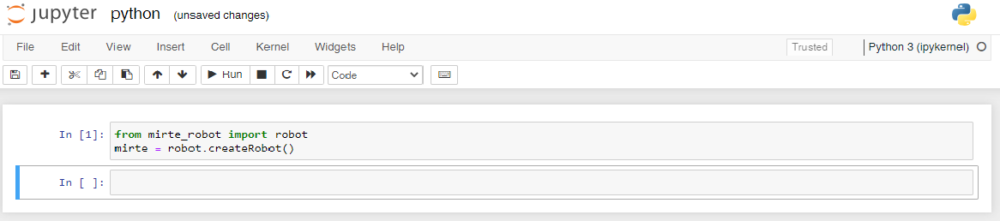

Programming MIRTE
#################

The goal of MIRTE is to get everyone to learn about robotics. This means that there are multiple layers of complexity available.

Blockly
=======

The easiest way to program your MIRTE robot is to use Blockly. Depending on your settings,
you should be able to drag and drop different blocks onto the canvas. By doing so, you
can create your own logic for the robot.

      .. image:: ../_images/programming_blockly.png
        :width: 600
        :alt: Blockly programming

Running this code can be done in the control bar on the top. It is also possible to pause your
code from running (not that sensor values of course keep changing), step through your code, and
stop your program from running.

      .. image:: ../_images/web_control.png
        :width: 600
        :alt: MIRTE control bar

.. note::
   When your program is finished running the robot will automatically also stop the motors
   from running. This is to make sure that you do not forget to stop the motors. This also
   means that only including a setMotorSpeed will not make your robot move.

Python
======

One level more advanced is programming your MIRTE robot in Python. This can be done in two ways.

From web interface
------------------

Below the Blockly canvas you can also find the Python code generated by Blockly. You can just
modify the Python-code and run it with the same control bar as Blockly.

      .. image:: ../_images/programming_python_web.png
        :width: 600
        :alt: Blockly Python from Web interface

In Jupyter Notebook
-------------------

Jupyter is disabled by default (due to high RAM usage on the Orange Pi Zero 2). You can start it as a service:

.. code-block:: bash

   mirte$ sudo service mirte-jupyter start

Jupyter will run on http://mirte.local:8888 (note: it might take some time for Jupyter to start) showing some 
examples from Jupyter-ROS (which are located at /home/mirte/jupyter-ros). If you want Jupyter to start on boot you can run:

.. code-block:: bash

   mirte$ sudo systemctl enable mirte-jupyter

You can now enter Jupyter by brwosing to http://mirte.local:8888 and start a new notebook:

From terminal
-------------

Of course it is also possible to progrma the robot from withun the Python interpreter,
or your own Pytohn script. 

.. code-block:: python

   >>> from mirte_robot import robot
   >>> mirte = robot.createRobot()

Using onboard VS-code
---------------------

The MIRTE robot has VS-code installed, which can be accessed though http://mirte.local/code.

Using VS-code
-------------

ROS
===

In Jupyter Notebook
-------------------

Jupyter is disabled by default (due to high RAM usage on the Orange Pi Zero 2). You can start it as a service:

.. code-block:: bash

   mirte$ sudo service mirte-jupyter start

Jupyter will run on http://mirte.local:8888 showing some examples from Jupyter-ROS (which are located at /home/mirte/jupyter-ros). If you want Jupyter to start on boot you can run:

.. code-block:: bash

   mirte$ sudo systemctrl enable mirte-jupyter

From terminal
-------------

When MIRTE boots a systemd service will launch the MIRTE bringup. This service can be stopped and started manually as well:

.. code-block:: bash

   mirte$ sudo service mirte-ros stop
   mirte$ sudo service mirte-ros start

You can also run the launchfile yourself (only when you stopped the systemd service):

.. code-block:: bash

   mirte$ roslaunch mirte_bringup bringup.launch

Using onboard VS-code
---------------------

The MIRTE robot has VS-code installed, which can be accessed though http://mirte.local/code.

Using VS-code
-------------

Using ROS icw Python API
------------------------

Although not preferred, at some point it might be useful to combine the existing Python API
with ROS. This can be done, but in that case you do not need to start a ROS node anymore.
The example below will listen to a `Twist <http://docs.ros.org/en/noetic/api/geometry_msgs/html/msg/Twist.html>`_ 
message published on cmd_vel and then use the Python API to drive around.

.. code-block:: python

   # Import and load the mirte API
   from mirte_robot import robot
   mirte = robot.createRobot()
   
   # Import rospy
   import rospy
   from geometry_msgs.msg import Twist

   # Move the robot based on the twist message
   def callback(twist_msg):
       speed = 0
       if (twist_msg.linear.x > 0.0):
          speed = 80    

       mirte.setMotorSpeed('left', speed)
       mirte.setMotorSpeed('right', speed)

   # Initialize the subscriber on the twist message
   rospy.Subscriber("cmd_vel", Twist, callback)

   # No need for rospy.init_node() or rospy.spin() since they
   # are already called in robot.createRobot().

Creating your own ROS packages/nodes
------------------------------------

MIRTE already uses a ROS workspace located at ~/mirte_ws. The easiest way to get started
is to use this workspace an create your own packages and nodes in this workspace. You can 
achieve this by executing the following commands:

.. code-block:: bash

   mirte$ cd ~/mirte_ws/src
   mirte$ catkin_create_pkg my_own_package stdmsgs rospy
   mirte$ cd my_own_package
   mirte$ mkdir scripts && cd scripts
   mirte$ touch my_node.py
   mirte$ cd ../../
   mirte$ catkin build

And of course one had to fill ~/mirte_ws/src/my_own_package/scripts/my_node.py with the
logic you want to be executed.

If you would also like to have this node to be started at boot you can add this to the 
launchfile in ~/mirte_ws/scr/mirte_packages/mirte_bringup/minimal.launch. That is the 
file that will be executed as you can see in /usr/local/src/mirte/mirte-install-scripts/services/mirte-ros.service.

